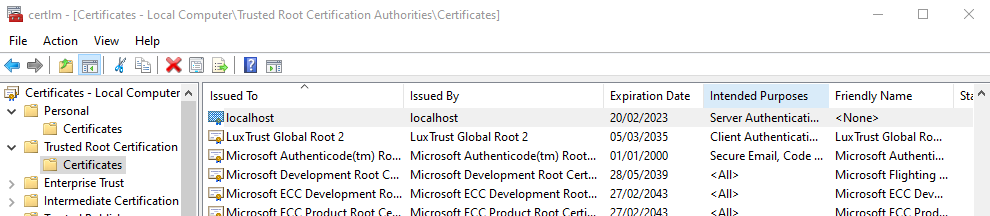

# Secret Santa

## Debugging locally with https
https://nicksnettravels.builttoroam.com/post-2019-04-30-working-with-self-signed-certificates-certificate-pinning-in-windows-uwp-application-with-xamarinforms-aspx/

The certificate genereated by `dotnet dev-certs` will be in cert store but not trusted unless `--trust` is used.

For the solution described in nicksnettravels to work the cert must be in the Trusted Root Certification in the Local Computer cert store. 


To convert a cer to pem in WSL2

``` powershell
certutil -encode .\localhost.cer localhost.pem
```

